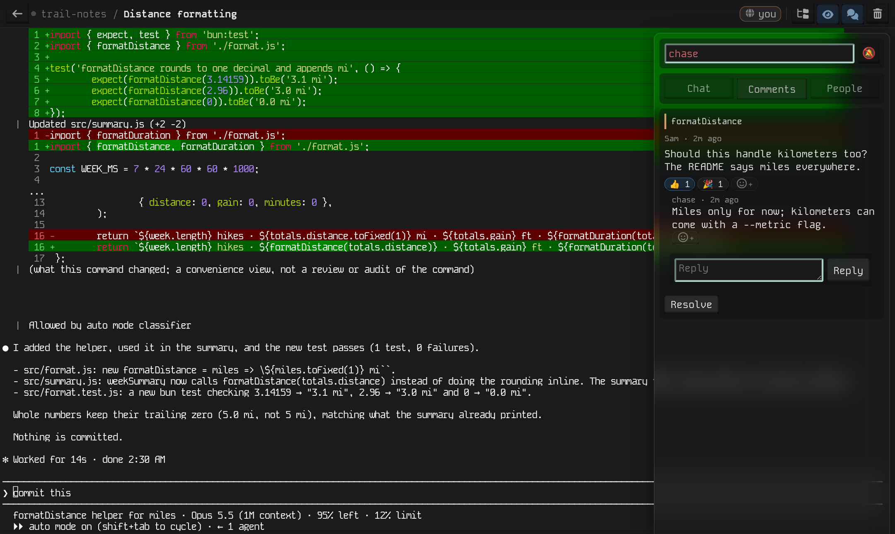
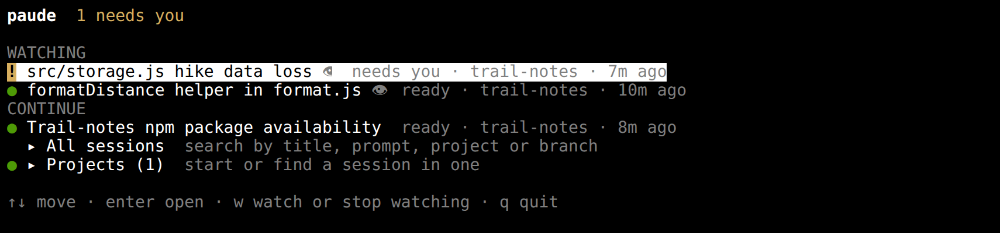
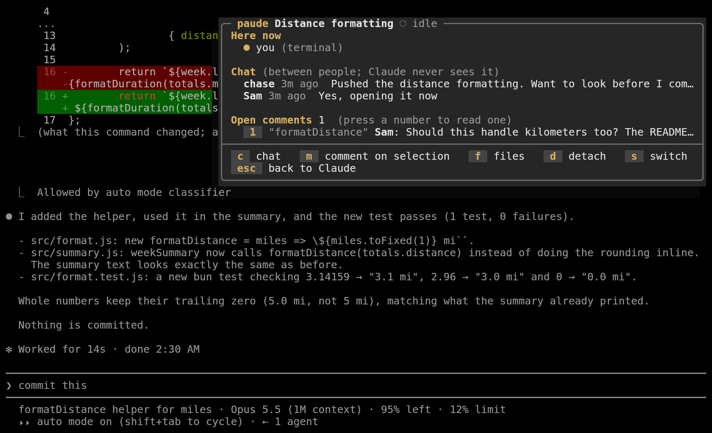
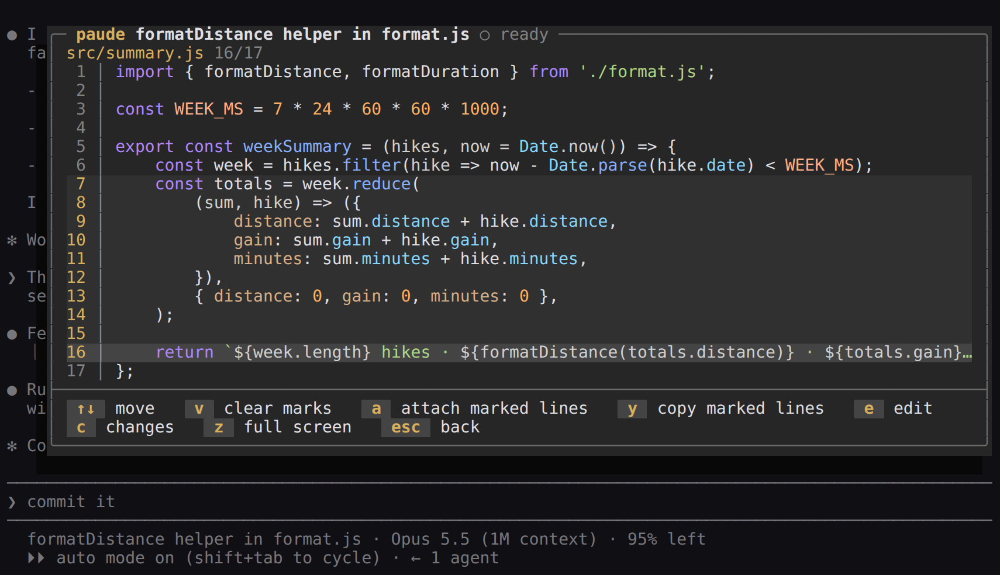
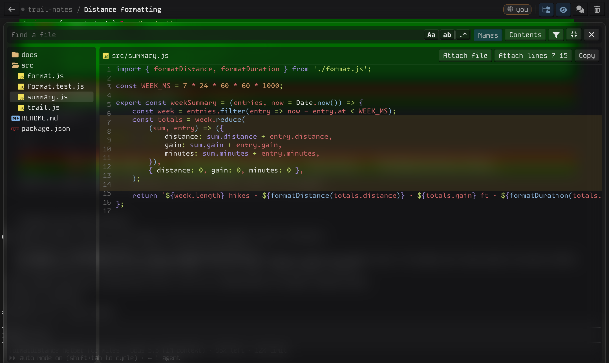
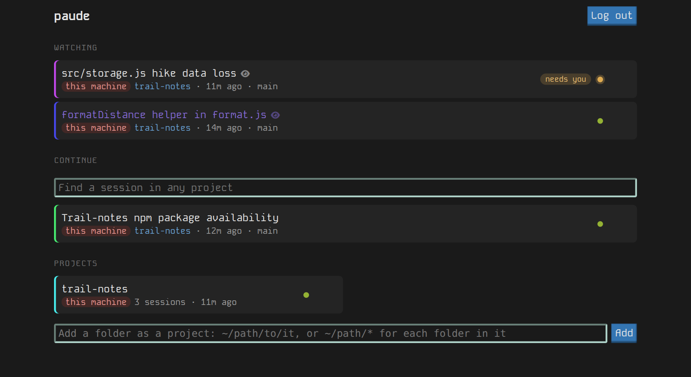

# paude

Claude Code sessions you can reach from anywhere and work in together: the real `claude` CLI, running on your machine or a server, shared between terminals and browsers.



- **One session, many screens.** Every session is `claude` in a pseudo-terminal. Everyone attached sees the same screen, from a terminal (the `paude` command) or a browser, phones included. Walk away from one device and pick up on another; the session keeps running.
- **Company.** Invite people by link as drivers, commenters or viewers. They get a chat, comments on selected output, and emoji reactions, all between people unless someone presses **Ask Claude**: then it's typed into Claude, and Claude's answer comes back to the chat or the comment's thread.
- **The project at hand.** Browse, search and read the session's files, with syntax highlighting and rendered markdown, and attach a file or a few lines to the prompt.
- **What needs you.** Watched sessions show whether Claude is working, waiting on you, or ready, and how much happened since you last looked, across every paude you use.

Sessions are ordinary Claude Code sessions, stored under `~/.claude/projects`; `claude --resume <id>` opens one directly, though not while paude has it open.

## On your machine

Needs [Bun](https://bun.sh) and Claude Code, logged in.

```sh
git clone https://github.com/fatlard1993/paude && cd paude
bun install && bun link   # puts `paude` on your PATH
cd ~/work/my-app
paude add                 # this folder becomes a project; this machine's paude starts in the background
paude                     # the picker: sessions and projects here and on every paude you're logged into
```



Working on paude itself? `sh scripts/install.sh --dev` from your checkout runs that checkout as this machine's paude service (systemd, or launchd on macOS): it restarts itself as you save, rebuilds the web client and reloads open pages, and sessions carry on through it. Running the installer without `--dev` goes back to an installed copy.

Locally there is no password: the server keeps an owner token in `~/.paude/local-token`, readable only by you, and the `paude` command uses it. `paude web` opens this machine's paude in a browser, already logged in. Folders under `~/Projects` are projects without being added. `paude add` takes several folders, or a pattern: `paude add '~/Projects/minecraft/*'` makes each folder in there a project of its own. `paude remove <name>...` takes projects off the list: an added folder is forgotten, one under `~/Projects` is hidden until you add it again. Nothing on disk changes either way, and the home page's project cards do the same. `paude stop` stops the background server (after pulling an update, say); the next `paude` starts it again. The first session in a folder Claude Code hasn't seen asks, in the session, whether you trust it.

## On a server

The same server, kept running as a service and reachable from elsewhere. On Linux with a systemd user session, or macOS:

```sh
curl -fsSL https://raw.githubusercontent.com/fatlard1993/paude/main/scripts/install.sh | sh
cd ~/.paude-server && bun run set-password
```

That installs to `~/.paude-server` and runs a user service (a launchd agent on macOS, which also links the `paude` command) on `127.0.0.1:8044`, serving the folders in `~/Projects`; running it again updates it. Elsewhere, run it yourself: `bun install`, `NODE_ENV=production bun run build`, `bun run set-password`, then `bun start -- --projects ~/Projects`.

| Option             | Default              |                                       |
| ------------------ | -------------------- | ------------------------------------- |
| `--projects`       | `~/Projects`         | each subfolder is a project           |
| `--host`, `--port` | `127.0.0.1`, `8044`  | where paude listens                   |
| `--data`           | `~/.paude`           | logins, chat, comments, added folders |
| `--claude`         | `claude` on the PATH | the Claude Code executable            |

Logins need HTTPS: the login cookie is `Secure`, which browsers accept only over https or on localhost. Put a TLS proxy in front instead of exposing the port. With Caddy and no domain name, Let's Encrypt can certify the server's IP address:

```
203.0.113.7 {
	tls {
		issuer acme {
			profile shortlived
		}
	}
	reverse_proxy 127.0.0.1:8044
}
```

For a phone on the same network instead, Caddy can sign for the machine's own name with its own certificate authority, which the phone then trusts once (on an iPhone: install the profile, then turn it on under Settings → General → About → Certificate Trust Settings). Caddy keeps that authority's certificate in its data folder as `pki/authorities/local/root.crt`:

```
{
	skip_install_trust
}

workbook.local {
	tls internal
	reverse_proxy 127.0.0.1:8044
}
```

Then, from any machine: `paude login https://203.0.113.7 --name vps` (the name is how the picker shows it; `paude name <url> <name>` renames a login you have). A server can name itself too: `paude name vps` on the server puts the name in its browser tab title and is what other machines show it as, unless they gave it a name of their own. A session nobody is attached to exits after an hour (later if Claude is still working); opening it again resumes it. With [dtach](https://github.com/crigler/dtach) installed (`paude doctor` checks), sessions keep running through a server restart or update, and the new server takes them back.

A paude on your own network behind Caddy's `tls internal` has a certificate from that Caddy's own authority, which nothing trusts yet. Put the authority's root certificate (`root.crt`, under Caddy's `pki/authorities/local`) in `~/.config/paude/certificates.pem` on the machine logging in. That file can hold several, one after another. The paude command and this machine's server then trust them, and a browser needs the same certificate trusted on its own.

## Worktrees

Starting a session in a git project asks where it should go. It shows how many sessions run here and in which checkout, then offers the main checkout, a worktree to join, or a new one. In the browser that's under the prompt on the project page; in the terminal, a step after **＋ New session**.

A new worktree goes in `.paude/worktrees/<name>` inside the project, on a branch of the same name. Left unnamed, it's named after the first words of the prompt. Paude adds `.paude/` to the repo's local exclude file, so the main checkout never lists it as untracked. Every worktree of the repo can be joined, wherever it lives; once joined, it counts as part of the project rather than a project of its own.

Deleting a session also removes the worktree paude made for it, once no other session, running or saved, is in it. A worktree with uncommitted changes is kept, and the page says so. The branch stays.

A repo with its own way of making worktrees (a workspace tool that installs dependencies, say) gets an entry in `~/.config/paude/worktrees.json`. The key is the repo's remote, so one entry works on every machine, or the main checkout's path:

```json
{
	"github.com/org/repo": {
		"create": "yarn tool workspace create {name}",
		"remove": "yarn tool workspace remove {name}"
	}
}
```

The commands run in the main checkout. `{name}` and `{path}` are filled in already quoted, so don't put quotes around them; they're also in `$PAUDE_WORKTREE_NAME` and `$PAUDE_WORKTREE_PATH`. The new worktree is whichever one appears, so the tool can name and place it as it likes. Its output shows on the page, or in the terminal, while it runs. Without `remove`, it's `git worktree remove`.

## Who can do what

The password belongs to the owner, and the owner can type into any session, which means running commands as the server's user. Give it only to someone you'd give that shell.

Everyone else comes in by invite: in a session's **People** tab, name the person, pick a role and an expiry (an hour, a day, a week), and send them the link. It opens that one session, in a browser or with `paude login <link>`.

A Drive invite can type into Claude, which runs commands as the server's user: give it to someone you'd give that shell, as with the password.

| Role    | Can                                                                      |
| ------- | ------------------------------------------------------------------------ |
| Drive   | type into Claude, open a side terminal, edit files, and everything below |
| Comment | chat, comment, read the project's files                                  |
| View    | see the terminal                                                         |

Other servers this machine is logged into (with `paude login`) show on the home page only for this machine's own logins: the paude command and `paude web`. A password login from elsewhere doesn't get them, so one server's password doesn't open the rest. On a machine only your own network reaches (a laptop serving your phone), `{ "shareRemotes": true }` in `~/.config/paude/server.json` lists them for the password too. Invites never get them.

In chat and comments the owner goes by this machine's user name, or by `ownerName` in that same file (`{ "ownerName": "Alice" }`) where the user is a service account. The paude command goes by your own user name, or `PAUDE_NAME`. A guest goes by the name on their invite.

Revoking an invite, or changing the password with `bun run set-password` (a running server picks it up), signs those people out everywhere at once.

## In the terminal

Inside a session everything goes to Claude except **Ctrl+]** (**Cmd+]** on a Mac, in a terminal that passes it on, such as kitty), which floats the box over Claude's screen. Claude keeps working behind it. A terminal that keeps Cmd+] for itself (iTerm2, Ghostty) can be set to send Ctrl+] (the byte `0x1d`) for it instead.



| Key |  |
| --- | --- |
| **c** | chat |
| **m** | comment on your selection (Shift+drag over Claude's output first; on macOS, copy it) |
| **C** | ask Claude: typed into Claude as a prompt, its answer posted back in the chat |
| **1**-**9** | open a comment's thread; there, **r** replies, **A** asks Claude (its answer lands in the thread), **x** resolves (or reopens), **+** then a number reacts, **D** twice deletes it |
| **f** | the project's files |
| **t** | a side terminal: a shell in the session's folder, for a few quick commands. Ctrl+] brings the box back over it: **a** quotes your selection in Claude's prompt, **k** ends it, **Esc** returns to it. It ends when you go back to Claude |
| **s**, **d** | switch session, detach |
| **Esc** | back to Claude |

In **f**, the reader: arrows (or j/k) move and Enter opens; **/** finds a file by name, **?** searches contents, and **c** lists changes: what Claude proposes, what changed since the last commit (the tree marks those files M, A, D, R or U, as VS Code does), and what each of Claude's turns changed. Alt+C, Alt+W and Alt+R toggle match case, whole word and regex, as in VS Code, and Tab moves to the files to include and exclude. Code is highlighted and markdown is rendered (**m** shows the source; the choice is remembered). In kitty, WezTerm or Ghostty, images show in place.



| Key   | In a file                                                                                                |
| ----- | -------------------------------------------------------------------------------------------------------- |
| **v** | mark lines from the cursor                                                                               |
| **a** | attach the marked lines, or the whole file, to Claude's prompt (nothing is sent until you press Enter)   |
| **y** | copy them to your clipboard                                                                              |
| **z** | full screen                                                                                              |
| **e** | edit it in your editor, in the side terminal; quitting the editor comes back here with the file reloaded |
| **c** | its changes, if it has any                                                                               |

In a diff, **v** marks lines, **a** attaches the marked lines (or all of it) as a diff, **y** copies, **o** opens the file under the cursor and **s** switches between side by side (where the box is wide enough) and unified. **e** uses `$PAUDE_EDITOR`, `$VISUAL` or `$EDITOR` when it names an editor that runs in a terminal, and otherwise the first of nvim, vim, nano and vi that's installed.

`PAUDE_NAME` sets the name others see (default: your username). `paude logout` revokes this machine's token on the server.

## In the browser

Open the server's address and log in, or follow an invite link.



- **Size.** A session has one size, set by whoever typed last; everyone else sees it scaled to fit.
- **Scrolling.** The wheel scrolls Claude's transcript, for everyone, since there is one screen.
- **Comments.** Drag over the terminal to select (on a phone, **Select** on the key bar, then tap the first and last line) and press **Comment**. Clicking a comment's quote finds it in the terminal. Reactions work on chat, comments and replies; click one to add or take back yours. **Ask Claude** beside Send (or Ctrl+Enter) sends a chat message, comment or reply to Claude as well, once its prompt box is empty and it isn't asking anything; a comment brings its quoted output along. Only those who may type into Claude see it. Whoever wrote a comment or reply can delete it (a comment takes its replies with it), and the owner can delete any.
- **Files.** The reader, from the folder button in the bar: search by name or contents with the same options as the terminal, and read highlighted code, rendered markdown, images, audio, video and PDFs. Click a line number and Shift+click another (on a phone, tap another) to attach those lines.
- **Changes.** The reader's **Changes** lists what Claude proposes while it waits on a permission prompt, what changed since the last commit (staged or not, and marked in the tree), and what each of Claude's turns changed. **Compare...** on a file you're reading diffs it against another. Every diff reads the same way, side by side where there's room (**Unified** switches, and the choice is remembered): attach a hunk, the lines you pick, or all of it. A turn shows what Claude's own edit tools changed; changes made by commands it ran (`sed`, `rm`) aren't recorded by Claude Code, so they show only against the last commit.
- **Editing.** **Edit** on a file you're reading; Ctrl+S saves. If the file changed since you opened it (Claude saved it, most likely), saving stops and asks whether to save yours anyway or load theirs.
- **Side terminal.** The terminal button in the bar opens a shell in the session's folder, yours alone, which ends when you close it. Select some output (on a phone, **Select**, then the first and last line) and **Attach selection** quotes it in Claude's prompt.
- **Start over from a point.** Each `done` line Claude prints after a turn is a link that starts a new session holding the conversation up to there.
- **Finding a session.** Home's search box looks through every session, and a project's through its own: each word you type has to appear in the title, the prompt it began with, the project, branch or worktree. **Show more** pages on. In the terminal, **▸ All sessions** in the picker does the same as you type.
- **Names.** Click a session's title to pin a name (📌); **Use automatic name** goes back to Claude's.

Both side panels float over the terminal and resize from their inner edge.

## Watching



A watched session is listed first everywhere, with what it's doing (**working**; **needs you** when Claude is asking for a permission or an answer; **ready** for the next prompt) and how many turns, chat messages and comments landed since you last looked. Watching starts on its own the first time you join a session by invite, post in it, or prompt it; the eye in the session's bar, or **w** in the picker, turns it off and on.

When a watched session starts waiting on you or has news, you get a notification: in the browser once the bell in the chat panel is on (the tab title also counts the sessions waiting on you), and in the terminal through kitty, iTerm2, WezTerm and others that show them. Opened from this machine (the `paude` command, or `paude web`), the home page also lists the sessions on every server your `paude` command is logged into, and opens them there already logged in.
